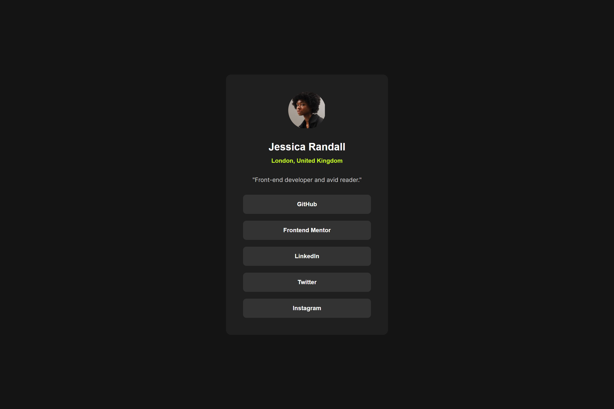

# Frontend Mentor - Social links profile solution

This is a solution to the [Social links profile challenge on Frontend Mentor](https://www.frontendmentor.io/challenges/social-links-profile-UG32l9m6dQ). Frontend Mentor challenges help you improve your coding skills by building realistic projects.

## Table of contents

- [Overview](#overview)
  - [The challenge](#the-challenge)
  - [Screenshot](#screenshot)
  - [Links](#links)
- [My process](#my-process)
  - [Built with](#built-with)
  - [What I learned](#what-i-learned)
  - [Continued development](#continued-development)
  - [Useful resources](#useful-resources)
- [Author](#author)
- [Acknowledgments](#acknowledgments)

## Overview

### The challenge

Users should be able to:

- See hover and focus states for all interactive elements on the page

### Screenshot



### Links

- Solution URL: [Add solution URL here](https://your-solution-url.com)
- Live Site URL: [Add live site URL here](https://your-live-site-url.com)

## My process

### Built with

- Semantic HTML5 markup
- CSS custom properties
- Flexbox
- Mobile-first workflow
- Custom fonts using `@font-face`

### What I learned

Working on this project helped me refine my understanding of using custom fonts in a web project. I integrated multiple font weights and styles using the `@font-face` rule, which allowed me to include and use custom fonts directly from local files.

Additionally, I gained more confidence in using Flexbox to create responsive layouts with centered and column-based alignment. Here’s a piece of CSS code I’m proud of:

```css
.flex-center {
  display: flex;
  align-items: center;
  justify-content: center;
}
```

````

This snippet demonstrates how simple properties in Flexbox can achieve a clean, centered layout.

### Continued development

In future projects, I aim to further explore:

- **CSS Grid:** To enhance my layouts and create more complex, grid-based designs.
- **Performance Optimization:** Focusing on optimizing web font loading strategies, such as using `font-display: swap` and serving fonts in WOFF2 format.
- **Accessibility:** Ensuring that all interactive elements are fully accessible by improving focus states and keyboard navigation.

### Useful resources

- [MDN Web Docs - @font-face](https://developer.mozilla.org/en-US/docs/Web/CSS/@font-face) - This resource helped me understand the correct way to implement custom fonts in CSS.
- [CSS-Tricks - A Complete Guide to Flexbox](https://css-tricks.com/snippets/css/a-guide-to-flexbox/) - A comprehensive guide that clarified how to use Flexbox for responsive layouts.
- [Google Fonts](https://fonts.google.com/) - Even though I used local fonts, Google Fonts is a great resource for finding web fonts and understanding best practices for font integration.

## Author

- Frontend Mentor - [@Jomagene](https://www.frontendmentor.io/profile/Jomagene)
- Twitter - [@Jomagene](https://www.twitter.com/Jomagene)

## Acknowledgments

I’d like to thank the Frontend Mentor community for providing feedback and inspiration throughout this project. The articles and code snippets shared by other developers greatly contributed to my learning process.

```

```
````
