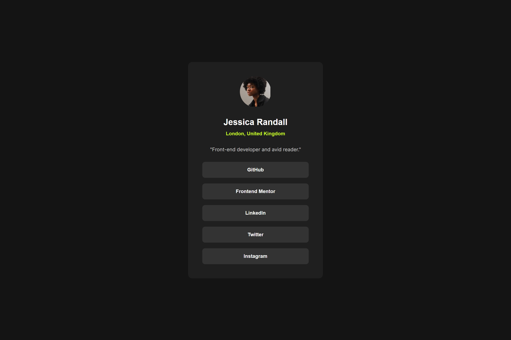

# Frontend Mentor - Social links profile solution

This is a solution to the [Social links profile challenge on Frontend Mentor](https://www.frontendmentor.io/challenges/social-links-profile-UG32l9m6dQ). Frontend Mentor challenges help you improve your coding skills by building realistic projects.

## Table of contents

- [Overview](#overview)
  - [The challenge](#the-challenge)
  - [Screenshot](#screenshot)
  - [Links](#links)
- [My process](#my-process)
  - [Built with](#built-with)
  - [What I learned](#what-i-learned)
  - [Continued development](#continued-development)
  - [Useful resources](#useful-resources)
- [Author](#author)
- [Acknowledgments](#acknowledgments)

## Overview

### The challenge

Users should be able to:

- See hover and focus states for all interactive elements on the page

### Screenshot



### Links

- Solution URL: [Add solution URL here](https://your-solution-url.com)
- Live Site URL: [Live link](https://jomagene.github.io/social-links-profile/)

## My process

### Built with

- Semantic HTML5 markup
- CSS custom properties
- Flexbox
- Mobile-first workflow
- Custom fonts using `@font-face`
- Responsive design using Media Queries

### What I learned

Working on this project helped me refine my understanding of several key web development concepts, including the use of custom fonts and responsive design techniques. Here's a breakdown of what I learned:

1. **Custom Fonts:**
   I integrated multiple font weights and styles using the `@font-face` rule, which allowed me to include and use custom fonts directly from local files. This approach gave me greater control over the typography used in the project.

   ```css
   @font-face {
     font-family: "Inter";
     src: url("../assets/fonts/Inter-VariableFont_slnt,wght.ttf") format("truetype"),
       url("../static/Inter-Regular.ttf") format("truetype");
     font-weight: 400;
     font-style: normal;
   }

   @font-face {
     font-family: "Inter";
     src: url("../static/Inter-Semibold.ttf") format("truetype");
     font-weight: 600;
     font-style: normal;
   }
   ```

2. **CSS Custom Properties:**
   Using CSS custom properties (variables) helped streamline the styling process. For example, defining font sizes and weights as variables made it easy to maintain consistency throughout the project and quickly apply changes.

   ```css
   :root {
     --small-font: 14px;
     --large-font: 24px;
     --regular: 400;
     --bold: 600;
   }
   ```

3. **Responsive Design:**
   I employed a mobile-first approach, ensuring that the design is responsive and looks great on all screen sizes. Media queries were used to adjust the layout for larger screens, providing a consistent user experience across devices.

   ```css
   @media (min-width: 450px) {
     li {
       width: 305px;
     }
   }
   ```

### Continued development

In future projects, I aim to continue refining my skills in:

- **CSS Grid:** Expanding my knowledge to create more complex, grid-based layouts.
- **Performance Optimization:** Improving web font loading strategies, such as using `font-display: swap` and serving fonts in WOFF2 format for faster load times.
- **Accessibility:** Ensuring all interactive elements are fully accessible by enhancing focus states and keyboard navigation.

### Useful resources

- [MDN Web Docs - @font-face](https://developer.mozilla.org/en-US/docs/Web/CSS/@font-face) - This resource helped me understand the correct way to implement custom fonts in CSS.
- [CSS-Tricks - A Complete Guide to Flexbox](https://css-tricks.com/snippets/css/a-guide-to-flexbox/) - A comprehensive guide that clarified how to use Flexbox for responsive layouts.
- [Google Fonts](https://fonts.google.com/) - Even though I used local fonts, Google Fonts is a great resource for finding web fonts and understanding best practices for font integration.

## Author

- Frontend Mentor - [@Jomagene](https://www.frontendmentor.io/profile/Jomagene)
- Twitter - [@Jomagene](https://www.twitter.com/Jomagene)

## Acknowledgments

I’d like to thank the Frontend Mentor community for providing feedback and inspiration throughout this journey. The articles and code snippets shared by other developers greatly contributed to my learning process.
